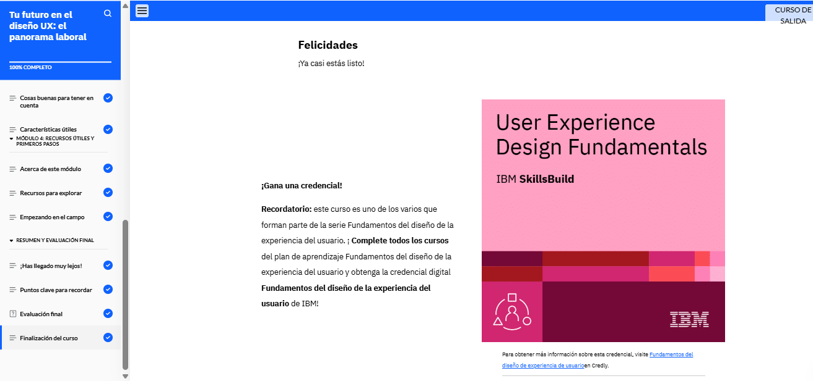
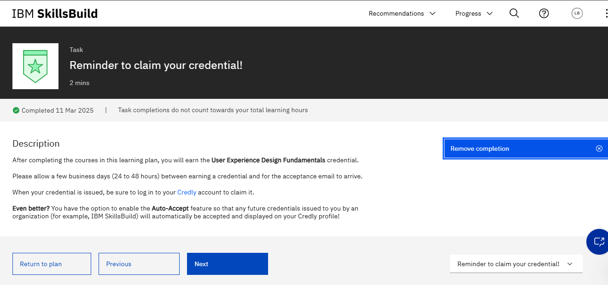

### En este espacio se mostrará evidencia del desarrollo de la certificación

#### Desarrollo del Modulo 1 de la certificación

En el módulo uno, exploramos los fundamentos del diseño UX, su propósito y los conceptos clave que lo hacen valioso. Aprendimos a diferenciarlo del UI design y conocimos el proceso de diseño centrado en el usuario (UCD). También analizamos la importancia de diseñar experiencias inclusivas, considerando la diferencia entre diseños adaptativos y responsivos. Finalmente, revisamos un caso de estudio en UX design, entendiendo sus componentes y los pasos necesarios para definir los requisitos de un proyecto exitoso.

### Modulo 2 Evaluacion Final
#### Conducting UX Research

En el módulo dos, aprendimos la importancia de la investigación UX para diseñar experiencias centradas en el usuario. Exploramos diversos métodos y técnicas de investigación, comprendimos el valor de las hipótesis y cómo sintetizar datos para extraer insights clave. También estudiamos el proceso de creación y uso de user personas y su impacto en el diseño UX. Además, analizamos cómo realizar un análisis competitivo y comparativo, evaluando productos en el mercado. Finalmente, revisamos un caso de estudio donde aplicamos estos conceptos para entender mejor a los usuarios y la competencia.

### Modulo 3 Evaluacion Final
#### Building a Story-based Design

En el módulo tres, aprendimos cómo las user stories ayudan a capturar las necesidades, desafíos y preferencias de los usuarios en el proceso de diseño UX. Vimos cómo estas historias sirven de base para crear user journeys y user flows, los cuales facilitan la navegación y la interacción dentro de un producto digital. También exploramos el concepto de solution sketches, que convierten ideas en soluciones visuales. Además, comprendimos la importancia del enfoque ágil en UX y revisamos un caso de estudio donde aplicamos estos elementos para mejorar la experiencia de un e-commerce de plantas.

### Modulo 4 Evaluacion Final
#### Wireframing and Prototyping
En el módulo cuatro, exploramos conceptos clave como la arquitectura de la información (IA), los sitemaps y la escritura UX, fundamentales para estructurar contenidos de manera clara y efectiva. Aprendimos sobre el proceso de wireframing, sus niveles de fidelidad y su importancia en la planificación del diseño. También analizamos los principios del diseño de interfaz (UI) y las mejores prácticas para garantizar la accesibilidad digital. Finalmente, vimos la importancia del prototipado, sus técnicas y cómo ayuda a validar la experiencia del usuario antes del desarrollo final, aplicándolo en un caso de estudio de un e-commerce de plantas.

### Modulo 5 Evaluacion Final
#### Conducting Usability Tests and Gathering Feedback

En el módulo cinco, aprendimos cómo los diseñadores UX evalúan sus diseños a través de pruebas de usabilidad. Exploramos los distintos métodos de prueba, tanto cualitativos como cuantitativos, y el proceso detallado para realizarlas. También vimos la importancia de la evaluación heurística y el uso de herramientas especializadas. Aprendimos a priorizar problemas utilizando niveles de gravedad y la matriz impacto-esfuerzo. Finalmente, analizamos un caso de estudio donde se aplicaron estas pruebas, se documentaron los hallazgos en un informe y se revisó un prototipo mejorado basado en la retroalimentación obtenida.

### Modulo 6 Evaluacion Final
#### Working Collaboratively with Teams on UX Design Projects

En el módulo seis, exploramos la importancia del trabajo colaborativo en proyectos de UX. Aprendimos cómo los diseñadores UX trabajan con otros equipos, como desarrolladores y gerentes de producto, para garantizar una experiencia de usuario efectiva. Vimos la importancia de la comunicación clara, el uso de herramientas colaborativas y la documentación detallada. También analizamos cómo se organizan los roles dentro del equipo, cómo se realizan las entregas de diseño y cómo se resuelven problemas en conjunto. Finalmente, revisamos un caso de estudio donde se aplicaron estas prácticas para mejorar la colaboración en un proyecto de diseño UX.

### Modulo 7 Evaluacion Final
#### Your Future in UX Design: The Job Landscape

En el módulo siete, exploramos el panorama laboral en el diseño UX y cómo prepararnos para ingresar a este campo. Aprendimos sobre las habilidades y herramientas más demandadas, las diferentes áreas en las que un diseñador UX puede especializarse y cómo estructurar un portafolio profesional. También analizamos estrategias para la búsqueda de empleo, la importancia del networking y la preparación para entrevistas. Finalmente, revisamos un caso de estudio que muestra cómo presentar proyectos de UX de manera efectiva para destacarse en el mercado laboral.

### Marked as completed

[Certificado en Credly](https://www.credly.com/badges/037905fc-9927-4385-9991-c897335b6da5/public_url)
