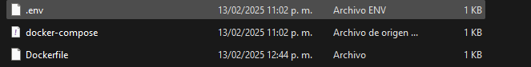
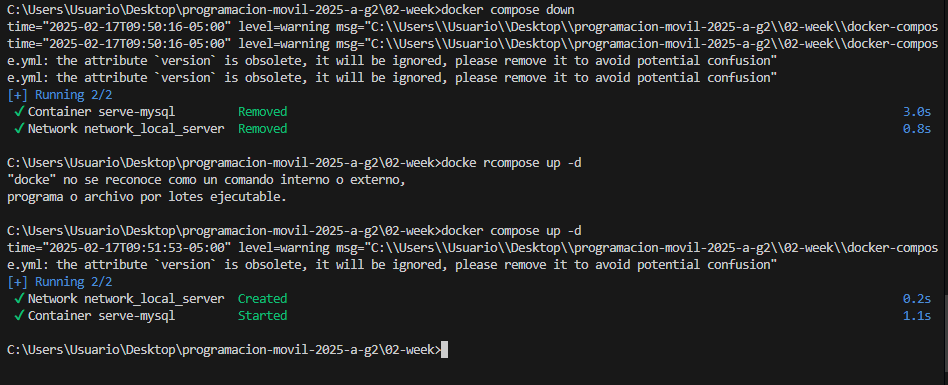
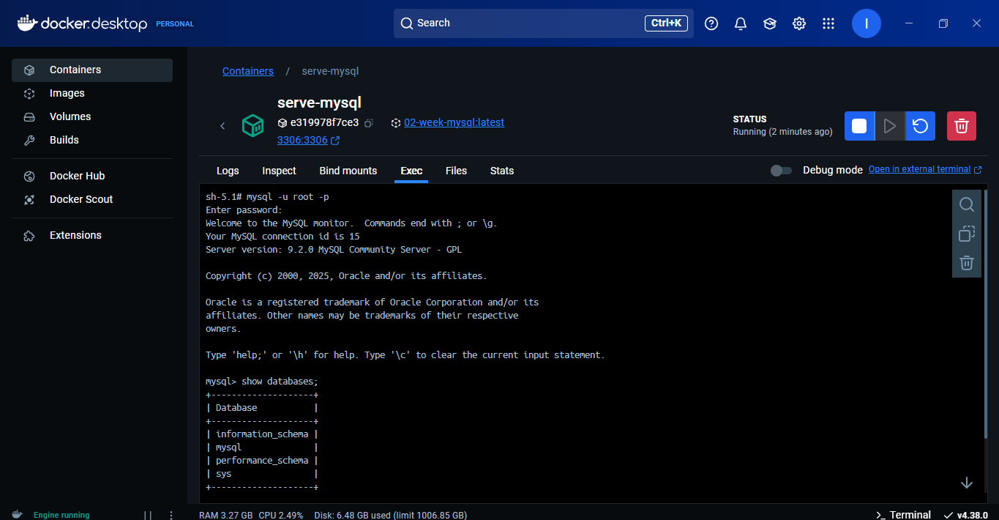
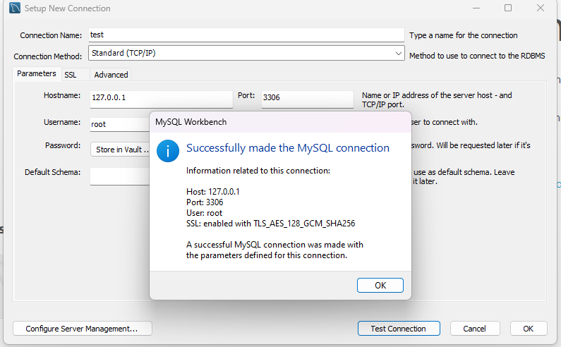

# Documentación de la Configuración del Contenedor

En este documento se hace la documentacion del paso a paso para la configuracion del ambiente del contenedor.


## Paso 1

### Instalación de Docker
Primero debemos instalar Docker en nuestro sistema operativo. Puede descargar e instalar Docker mediante el sitio web de la pagina.

# Paso 2
### Creación de un archivo Dockerfile
Una vez instalado Docker, debemos crear un archivo llamado Dockerfile en la raíz siendo en este caso la carpeta del repositorio. El archivo fue suministrado por el docente junto a 2 más siendo estos: .env y docker-compose.yml.


# Paso 3
Se abre la consola o terminal en la carpeta del repositorio y se ejecuta el siguiente comando:

  ```bash
   docker pull mysql:latest
```
Este comando nos permite descargar la imagen de mysql más reciente.
# Paso 4
Una vez descargada la imagen, debemos crear un contenedor a partir de ella. Para ello en la carpeta en la cual tenemos los archivos ***.env, docker-compose.yml y Dockerfile*** ejecutamos el siguiente comando:

```bash
docker-compose down
docker compose up -d
```

Este comando nos permite crear un contenedor a partir de la imagen de mysql más reciente y ejecutarlo.
# Paso 5
Se comprueba el acceso a mysql mediante el uso de consola:



Al mismo tiempo se comprueba el acceso mediante mysql workbench:
