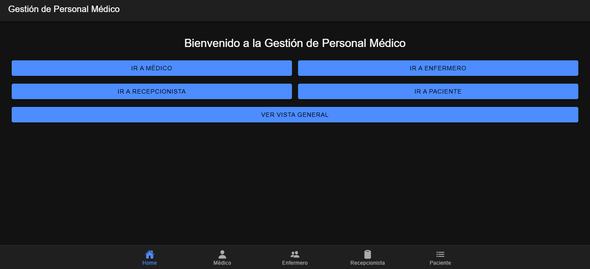
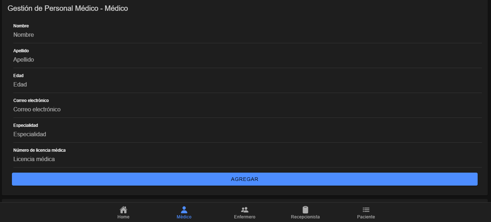
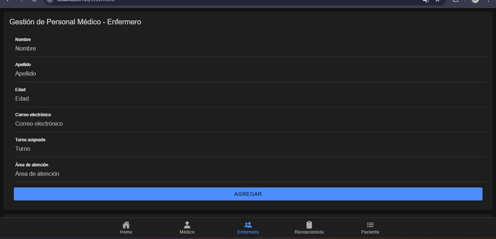
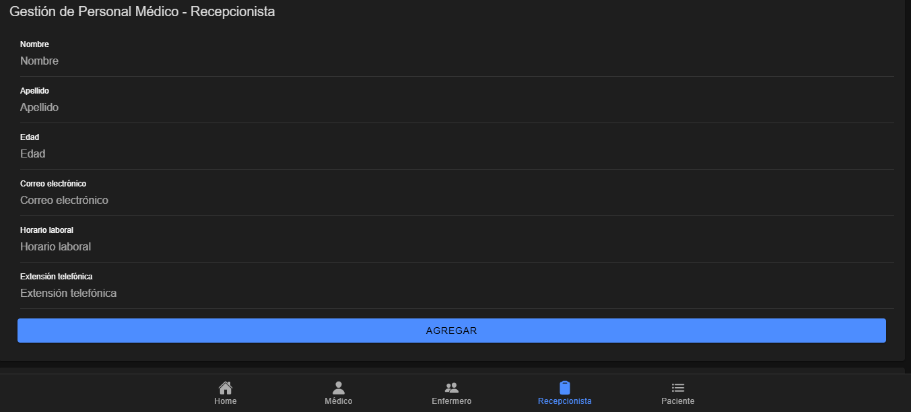
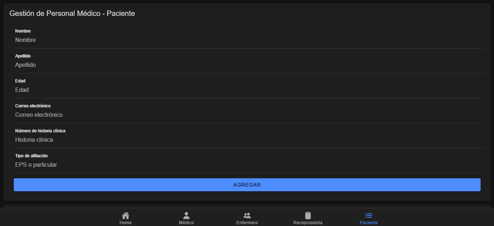
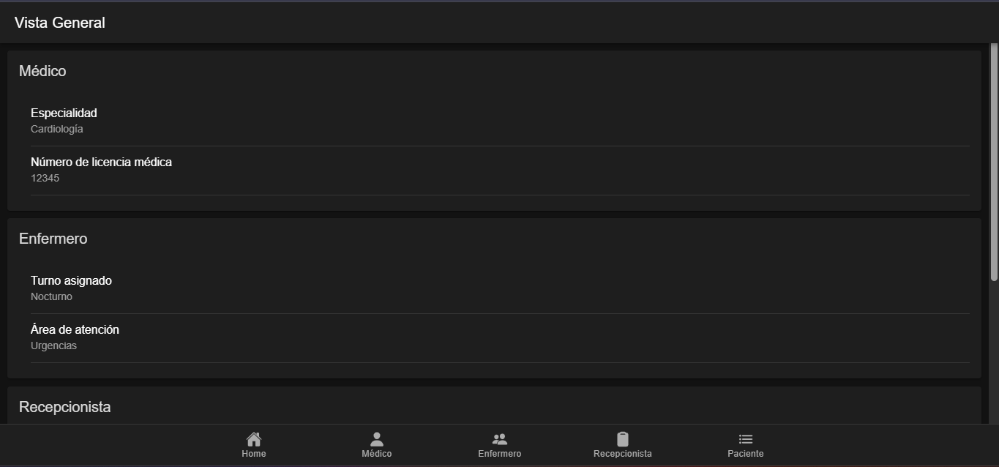

# Documentación de la Aplicación: Gestión de Personal Médico

## Capturas de Pantalla

### Pantalla de Inicio (Home)
- Contiene botones para navegar a las diferentes secciones: Médico, Enfermero, Recepcionista, Paciente y Vista General.
- Barra de navegación en la parte inferior para acceso rápido.

### Pantalla de Médico
- Formulario para agregar médicos con campos adicionales: Especialidad y Número de licencia médica.
- Lista de médicos agregados mostrada dinámicamente al final.

### Pantalla de Enfermero
- Formulario para agregar enfermeros con campos adicionales: Turno asignado y Área de atención.
- Lista de enfermeros agregados mostrada dinámicamente al final.

### Pantalla de Recepcionista
- Formulario para agregar recepcionistas con campos adicionales: Horario laboral y Extensión telefónica.
- Lista de recepcionistas agregados mostrada dinámicamente al final.

### Pantalla de Paciente
- Formulario para agregar pacientes con campos adicionales: Número de historia clínica y Tipo de afiliación.
- Lista de pacientes agregados mostrada dinámicamente al final.

### Vista General
- Muestra una card para cada rol con información general de los campos adicionales.

---

## Explicación de la Funcionalidad de los Componentes

### `GestionPersonalCard`
- **Función**: Componente reutilizable para manejar formularios y listas de registros.
- **Características**:
  - Permite agregar registros dinámicamente y los guarda en `localStorage`.
  - Utiliza el componente `CardView` para mostrar los registros agregados.

### `CardView`
- **Función**: Componente reutilizable para mostrar registros en formato de tarjetas (`IonCard`).
- **Características**:
  - Recibe una lista de datos (`dataList`) y campos adicionales (`additionalFields`) para renderizar dinámicamente.

### Pantallas Específicas (Médico, Enfermero, etc.)
- **Función**: Cada pantalla utiliza `GestionPersonalCard` con campos adicionales específicos para el rol.
- **Características**:
  - Muestra los registros agregados al final utilizando `CardView`.

### Barra de Navegación (`IonTabBar`)
- **Función**: Proporciona navegación dinámica entre las diferentes secciones de la aplicación.
- **Características**:
  - Implementada en `App.tsx` con íconos de `ionicons`.

---

## Justificación de los Campos Adicionales por Rol

### Médico
- **Especialidad**: Es necesario para identificar el área de experiencia del médico.
- **Número de licencia médica**: Es un requisito legal para validar la práctica médica.

### Enfermero
- **Turno asignado**: Permite organizar los horarios de trabajo.
- **Área de atención**: Especifica la ubicación donde el enfermero presta servicios.

### Recepcionista
- **Horario laboral**: Ayuda a gestionar los turnos de atención al público.
- **Extensión telefónica**: Facilita la comunicación interna en el centro médico.

### Paciente
- **Número de historia clínica**: Identifica de manera única al paciente en el sistema.
- **Tipo de afiliación**: Determina el tipo de cobertura médica (EPS o particular).

---

## Conclusión

El diseño implementado utiliza componentes reutilizables (`GestionPersonalCard` y `CardView`) para mantener el código limpio y modular. La barra de navegación (`IonTabBar`) mejora la experiencia del usuario al permitir una navegación fluida entre las secciones. Los campos adicionales por rol están justificados según las necesidades específicas de cada perfil en el centro médico.